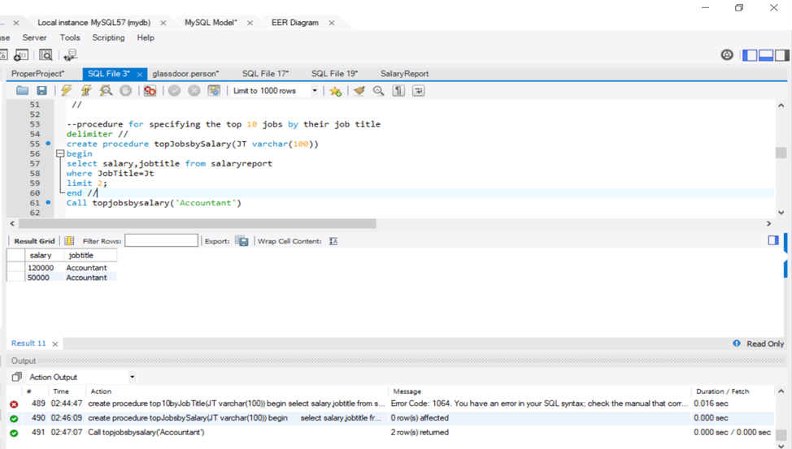

# Database Of A Recruiting Website

## Problem Statement

### Creation of a Glassdoor like Recruiting Website in MySQL

Looking for a job is a complicated process. Many factors need to be in place for the right candidate to find the right job. It can be hard to track and analyse data that will further help the job seekers a job of their choice. Similarly, for an employer, it is difficult to attract the right employees, therefore to help the employer, the Glassdoor manages database of what Job Seekers are looking for in a company. This company aims on matching the correct employer with right employee.

### Instructions on how to open this project 

Installations Required:
- MySQL Server
- MySQL Workbench

Run the files on MySQL Workbench

## EER Diagram

### Finding the names of all the people registered for the respective events with their Registration IDs using View

### Availability check on registration table using Trigger

### Calculating the revenue earned by any specific event type using Stored Procedure

### Analysis on Salary Report to find top jobs using Stored Procedure

### User Defined Functions to do analysis of the revenue given by the advertisers

### Analysis to find Eligible candidates with work authorization status

### Trigger to update the number of applications as new applications are received

### Analysis to find the revenue by Employer Branding 

## Use Cases

- Employer Branding: Just like in consumer marketing, employment branding is built on many moving parts that make up the overall image. And just like in consumer branding, employers need to constantly identify the parts in motion, including the ones that aren’t fully in the marketing team’s control. 
- Training and Activities:  Sessions that Glassdoor conducts like resume writing, self marketing, interview skills, etc.It involves marketing of  the events and conferences by Glassdoor happening all around United States wherein anyone can register.
- Job Postings: Platform where the employers can post jobs, where all job seekers can apply
- Salary Report: Any person can submit a report on the salary, position and name of the company, the analysis of this information can help the job seekers to get the right wage
- Giving opportunity for advertisers to advertise on the website

## Conclusion: 

Therefore, we have effectively analyzed the database of Glassdoor like recruiting website, this analysis helps the company keep track of the revenue and job postings. We have also made easier on the job seeker by adding the functionality to search for jobs by top salary and location. We have taken data from the user to get a estimation on the salary and generated a report. The database includes registration of the events and training sessions by anyone. The employer has the option to use brand enhancing techniques and the revenue generated so is calculated.

